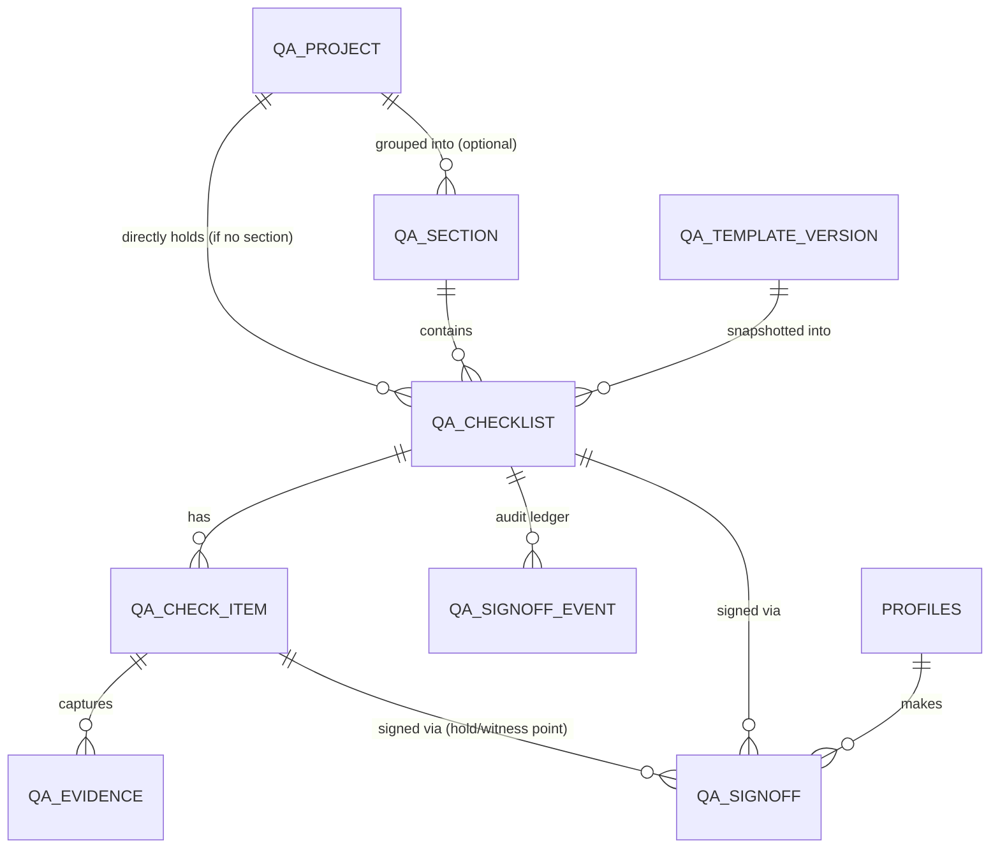

# QA Module — Design Doc (supersedes the original CONQA ERD)

Status: **Proposed** — not yet implemented. This is the single corrected
reference for the QA + work-package module that will replace the third-party
CONQA app. It reflects an audit of the existing `hector-egger-ops` codebase and
two rounds of direct inspection of the live CONQA app. Where this document and
the original "QA Module — Technical Planning Summary" disagree, **this document
wins** (see [§10 Changelog](#10-changelog-vs-original-plan)).

## Goal

Bring QA capture (inspection checklists, pass/fail steps, evidence photos,
hold-point sign-off) and QA reporting in-house, reusing the platform's existing
authentication, module conventions, approval patterns, and import pipeline
rather than rebuilding any of them. Build **online-first (PWA)** for the MVP;
true offline-first site capture is a later, separately scoped phase.

Guiding constraints from the platform:

- **C-base is the source of truth for QA *shape and authority*** — sheet
  definitions, project structure, and who-can-sign. The app is a one-way,
  read-only mirror of that. **The app must never write back to C-base.**
- **Signed-off records are immutable.** Corrections are new versioned entries,
  never overwrites.
- **Full audit trail** on every QA record: who created/edited/signed, and when.
- **QA report export must be reproducible** — regenerating a report yields the
  same result.

---

## 1. How this fits the existing codebase

The QA module follows the exact anatomy of `/production` and `/stock-take`,
which are the current quality bar alongside `/timesheet` and `/approvals`:

- Routes under `app/(protected)/qa/…` with `{page,actions,error,loading}.tsx`
  and a local `components/` folder.
- Server logic under `src/lib/qa/{types,data,actions,access,validation}.ts`.
- Pure, unit-tested rule modules (mirroring
  `src/lib/timesheets/final-approval-rules.ts` and the stock-take validation
  tests) for anything sign-off- or immutability-related.
- A migration under `supabase/migrations/` defining tables, indexes, and RLS.

Two architectural facts about this codebase shape every decision below:

1. **Supabase is reached through a hand-rolled `fetch` wrapper**
   (`src/lib/supabase/shared.ts`) hitting PostgREST URLs directly — there is no
   `@supabase/supabase-js`. Two clients exist: a **session client**
   (`createServerSupabaseClient`, user token, RLS applies) and a **service-role
   client** (`createServiceRoleSupabaseClient`, bypasses RLS). Mutations
   generally go through the service-role client, so **the real write gate is the
   app-layer `assert*Access` check; RLS is defense-in-depth.** QA must enforce
   authority in all three layers (app assertion + RLS policy + DB CHECK
   constraints), never RLS alone.
2. **The codebase hand-rolls dependencies on principle** (e.g. the XLSX exporter
   in `src/lib/timesheets/payroll-export-xlsx.ts` includes a from-scratch ZIP
   writer and CRC32). Anything requiring a heavy SDK (S3, PDF) is a deliberate
   departure and should be treated as a real decision, not a routine add.

---

## 2. Corrected domain model (Option C)

### 2.1 What changed and why

Direct inspection of live CONQA showed the top of the original ERD was wrong:

- **Project and Lot are collapsed.** CONQA lists e.g.
  `260013 - Cardrona - Type A - Lot 306` and `250013 - Cardrona Type A2 - Lot
  321` as *separate top-level projects*. The lot number is baked into the
  project name as text, not a nested structural level.
- **Lot is optional.** Many projects have no lot at all (e.g.
  `240007 - Te One School`, `240024 - Contract Labour`). "Project" is a flexible
  top-level container for any trackable job.
- **Work Package sits *inside* a project as one folder among siblings**
  (`SiteQA`, `LOADINGPLAN`, `WORKPACKAGE`, `PANEL`) — the reverse containment
  direction from the original `Project → Work Package → Lot` chain.
- **Checklist → Check Item → Evidence still holds** (confirmed via a filled-in
  inspection `EW_0001` with pass/fail steps and attached photos).
- Confirmed subsequently: ~95% of projects share the same folder shape
  (`SiteQA` / `WORKPACKAGE` / `PANEL` / `LOADINGPLAN`). The rare exceptions are
  temporary business-model experiments — handled gracefully by making sections
  optional and keeping the raw source path (§2.3).

**The reframe that makes this cheap:** in v1 the structure is *imported from
C-base, not authored in the app*. CONQA's "Add folder / Re-order" controls are
CONQA's authoring surface; our app only needs to **store and display** the
grouping the export provides. So we do **not** build a configurable nested-folder
editor — we mirror a structure as data and render it read-only.

### 2.2 The model



- **`qa_project`** — the one true top-level container everywhere. Lot and
  work-package identity live here as **metadata columns** (`lot_code`,
  `source_project_ref`), never as structural levels.
- **`qa_section`** — an *optional*, flat, orderable grouping (`SiteQA`,
  `PANEL`, `WORKPACKAGE`, `LOADINGPLAN`). **One level deep, no recursion.**
  Populated from the export. A project with no sections hangs checklists
  directly off itself.
- **`qa_checklist`** — an instantiated inspection sheet. This is where a
  **template version is snapshotted** (§4).
- **`qa_check_item`** — an individual pass/fail/NA step (with optional
  measurement value).
- **`qa_evidence`** — a photo (or file) attached to a check item; a metadata row
  in Postgres pointing at a blob in object storage (§5).
- **`qa_signoff`** — a hold-point / witness-point / checklist sign-off record;
  immutable once made.
- **`qa_signoff_event`** — append-only audit ledger of every sign-off / return /
  re-submit action.

### 2.3 The hedge that de-risks the unknown

On **`qa_checklist`**, also store the **raw imported folder path** as a text
array, e.g. `source_path = ['SiteQA', 'A.WALL']`. This mirrors the codebase's
existing "keep the source shape verbatim, flatten for use" habit
(`source_row_hash`, `source_file_name`, `*_snapshot` columns).

Consequences:

- If a rare project has three folder levels instead of one, **nothing is lost** —
  we can render nested from `source_path` without ever modeling recursion in
  tables. The query/report model still treats "checklist belongs to project" as
  the atom.
- The confirmation question ("do non-lot projects share the folder shape?") can
  no longer break the model — it only decides whether `qa_section` is *universal*
  or merely *optional*, and Option C already supports both.

### 2.4 Deferred entities

Do **not** model the full CONQA vocabulary up front. Defer these tables until
their phase, to avoid the over-modelling that forced two production-schema
rebuilds (`production_manual_v1_rebuild`, `production_project_files_priority1`):

| Entity | When |
|---|---|
| `qa_template` / `qa_template_version` | Phase A import (needed early — see §4) |
| `qa_project`, `qa_section`, `qa_checklist`, `qa_check_item`, `qa_evidence`, `qa_signoff`, `qa_signoff_event` | Phase 0 / Phase 1 spine |
| Variation | later phase, when the variation workflow is scoped |
| Project & folder templates (authoring blueprints) | Phase 3+, only if project *creation* moves in-house (see §4.3) |
| QA Report as a stored entity | Phase 2 (generation), possibly just derived-on-demand |

---

## 3. Authentication vs. authorization (one front door, two permission models)

The requirement "run QA on a separate auth so it doesn't get mixed up with the
existing codebase, and we can pivot later" resolves cleanly once *authentication*
and *authorization* are separated:

- **Authentication (who you are)** — **shared, single, untouched.** Reuse the
  existing login/session/cookie layer and `requireProtectedAccess`. **Do not**
  build a second login: two credential stores = two places to disable a leaver,
  double the attack surface, worse UX. One front door.
- **Authorization (what you may do)** — **QA gets its own, fully isolated model**,
  derived from the C-base export and living in its own tables. The existing
  modules keep `user_roles` + `staff_group`; QA never reads or writes those.

```
          ┌─────────────── one login / identity (shared) ──────────────┐
          │                        profiles                             │
          └───────────────┬───────────────────────────┬────────────────┘
                          │                            │
        existing model    │                            │   QA model (new, isolated)
   user_roles + staff_group                    qa_assignment / qa_signoff_authority
   → timesheet, production                     ← mirrored from C-base export
```

Concretely:

- **Shared/untouched:** `profiles`, session layer, base guard "are you a
  logged-in, approved human."
- **QA-only, new:** `qa_assignment` / `qa_signoff_authority` tables, a
  `requireQaAccess()` guard, QA permission helpers
  (`canSignHoldPoint(profileId, holdPointId)`), and RLS helper functions that
  read **only** the QA tables. QA RLS policies reference QA helpers, never the
  platform ones.
- **No edits** to `user_roles`, `permissions/roles.ts`, or existing policies
  except adding one nav entry in `src/lib/permissions/navigation.ts`. This is
  what makes QA unable to break timesheet/production, and what preserves the
  freedom to later unify the platform onto whichever model proves better.

Because sign-off authority and per-project/per-lot assignment come **from the
export**, QA authority is just **more mirrored data**, synced by the same
one-way versioned-upsert pipeline as templates. The app is never the source of
truth for QA authority — same read-only rule as everything else from C-base.

### 3.1 The one piece of glue: identity mapping

The export describes people in C-base's terms (names, possibly a C-base user id).
The app knows people as `profiles` rows tied to a login. A **matching step**
must link each C-base QA person to a `profiles.id` — almost certainly by
**email**. Without it, a logged-in user can't be recognised as "the inspector
assigned to Lot 306."

Open decisions:

- If a C-base QA person has **no platform login yet**: provision one, or show QA
  read-only to unknown users until they have a login? (Recommend: read-only
  until matched, to keep sign-off authority tight.)
- Store the mapping explicitly (`qa_person_link(source_person_ref, profile_id)`)
  so it survives name changes and is auditable.

> Note: "run multiple authorization models simultaneously as a live A/B" is
> possible but **not recommended** — it's a lot of machinery for little extra
> signal. The isolation above already delivers the pivot option; you evaluate
> QA's model in real use and reshape it freely because nothing else depends on
> it.

---

## 4. `qa_templates` — versioned import (Phase A of the C-base pipeline)

This is the **lowest-risk item**: a near-clone of the existing C-base timesheet
lookup import (`src/lib/timesheets/c-base-import.ts`, the admin UI at
`app/(protected)/admin/timesheet-lookups/import`, and the
`apply_c_base_timesheet_lookup_import` RPC). Reuse wholesale:

- Two-phase **prepare/validate → apply**, with a **dry-run** mode.
- Diff-based upsert keyed on a **SHA-256 `source_row_hash`** for change
  detection.
- **Soft-deactivate** semantics (`is_active`, `inactive_reason`, `inactive_at`,
  `last_seen_at`) — rows missing from a new export are deactivated, never
  deleted; re-appearing rows reactivate.
- An **import history table** logging every run (summary + validation errors) —
  the audit trail for free.
- **Fail loudly, keep last-known-good:** apply is blocked if any validation
  error exists; soft-deactivation means a broken import never wipes serving data.
- The hand-rolled XLSX parser is reusable if C-base exports Excel; a
  CSV/JSON path is a smaller variant of the same shape.

### 4.1 The one addition: version retention + snapshot-on-instantiate

The lookup tables mutate in place (one row per code) — they don't retain
versions. QA needs versions retained, because **a checklist must reproduce the
template it was created against, and a later template edit must never alter an
in-progress or signed-off checklist.** Combine two precedents already in the
codebase:

- Make **`qa_template_version(id, source_id, version, fields_json, source_row_hash,
  imported_at)` append-only per version** — never update a version row.
- When a checklist is instantiated, store `template_version_id` **plus a
  `fields_snapshot` copy** on the checklist (mirroring how
  `timesheet_entry_activities` freezes `project_code_snapshot` /
  `project_label_snapshot` at save time).

That satisfies reproducibility and immutability using two patterns already
proven in production here. Templates link to **`qa_project` directly** — no
assumption of a Lot layer beneath.

### 4.2 Checklist template grammar (from the real C-base export)

Confirmed against an actual factory panel-assembly sheet
(`EWi0e1 - 0 Internal Layer - 1 External Layer - Batts`). C-base exports a
checklist template as a flat row list on a `Master List Templates` sheet, with
columns `Id | Type | Name | Values | Prompting Name`. **`Type` is the grammar:**

| `Type` | Meaning | Maps to |
|---|---|---|
| `checklist` | Template header; `Id` = `<uuid>/<version>` (version is explicit) | `qa_template` (source_id = uuid) + `qa_template_version` (version) |
| `section` | A step ("Step 1 — Framing…"), stable UUID | a checklist step |
| `checkpoint` / `checkpoint-no-value` | Follows each section; plain `checkpoint` marks a formal gate | step flag `checkpoint: boolean` |
| `button` | An **answerable item**; `Values` = the allowed answers | `qa_check_item`, `input_type='select'`, `options: string[]` |
| `note` | Instruction / photo prompt ("Take Photos of…") | `qa_check_item`, `input_type='note'` (no answer) |
| `signoff` | Sign-off / hold point ("Sign off from Shift Leader.") | `qa_signoff` slot |

**Key correction to the earlier model:** check items are **enumerated
single-select**, not fixed pass/fail/NA. `Values` carries a per-item option list
— sometimes `Yes,No` or `Yes,No,Not Applicable`, but often a domain enum
(`Membrane,Ply H3 17,GIB13,…`; `R2.6,R2.8,R4.1,None`; fixing types; tapes).
"Pass/Fail" counts are a **derived rollup** (Yes→pass, No→fail, else neutral),
not the storage model. Every section and item carries a **stable UUID** — the
natural key for the diff-upsert and for attaching evidence.

The parser's target — one `qa_template_version.fields_json` per version, and the
value snapshotted into each checklist on instantiation:

```jsonc
{
  "source_id": "a79de97e-814b-4c88-8d4f-5b52a0bf4588",
  "version": 2,
  "name": "EWi0e1 - 0 Internal Layer - 1 External Layer - Batts",
  "steps": [
    { "id": "3774480b-…", "title": "Step 1 - Framing and Inside Layers", "checkpoint": false,
      "items": [
        { "id": "ffb006d6-…", "type": "select", "label": "Framing check for square.", "options": ["Yes","No"] },
        { "id": "d0cce61f-…", "type": "select", "label": "Slings installed as per drawings.", "options": ["Yes","No","Not Applicable"] },
        { "id": "9e9a6f9f-…", "type": "note", "label": "Take Photos of frame, fixings and connections." }
      ] },
    { "id": "846e7710-…", "title": "Step 6 - Final Sign Off", "checkpoint": true,
      "items": [ { "id": "73db703f-…", "type": "signoff", "label": "Sign off from Shift Leader." } ] }
  ]
}
```

Keep the **raw imported rows verbatim** alongside the parsed structure (same
§2.3 hedge) so nothing C-base encodes is lost if the grammar grows.

### 4.3 Project & folder templates — deferred

C-base also exports **project templates** and **folder templates** (a
`Project Structure` sheet describing tiers/folders for spinning up a *new*
project). These are **authoring blueprints**, not QA data. In v1 we mirror real
projects and their structure read-only from C-base and do not author projects
in-app, so these are **deferred** — they only matter when project *creation*
moves in-house (Phase 3+). They are not needed for factory QA capture.

---

## 5. Evidence photo storage — Supabase Storage first, R2 later

**Decision for v1: use Supabase Storage. Treat Cloudflare R2 as a later,
measured optimisation, not an MVP commitment.**

### 5.1 Why (the egress trap, stated precisely)

Object storage has two costs: **storage rent** (per GB, similar across
providers) and **egress** (a per-view "delivery fee" when a file leaves
storage). R2's egress is always zero; Supabase charges egress past a free
allowance. QA is read-heavy (every checklist view, every report, every
re-inspection is a delivery), which is a genuine argument *for* R2 — **but only
if photos are served the right way:**

- **Direct-pickup (presigned URL):** the device fetches the blob **straight from
  R2**. R2 egress is zero → genuinely free delivery. This is the only way R2
  pays off.
- **Middleman (proxy through the app):** the device asks the Next server, which
  fetches the blob and streams it back. The blob is delivered twice, and
  **Vercel charges egress on the second hop.**

The trap: **the only existing file-serving pattern in this codebase — the
avatar routes (`app/api/profile/avatar/route.ts`,
`app/api/avatar/[profileId]/route.ts`) — is the middleman pattern.** Copying it
with R2 yields R2's costs and none of its savings. Capturing R2's benefit means
building presigned "direct-pickup" URLs, which R2 doesn't hand you for free — it
needs AWS **SigV4** request signing, either hand-rolled (consistent with house
style, but new, fiddly plumbing) or via `@aws-sdk/client-s3` (the first heavy
external dependency). That's real net-new work and risk.

### 5.2 Why Supabase Storage for v1

- **Same family you already use**; the avatar flow is a working, safe template
  (private bucket + service-role-gated serve route + auth check in the route).
  Essentially nothing new to learn or build.
- **The free/Pro tier allowance comfortably covers a pilot** — you can prove the
  whole capture loop without spend and without R2.
- R2's savings only matter above real volume you can't yet measure. **Start
  simple, instrument the egress bill, switch to R2 later *if* it hurts.**
  Switching is contained (change where blobs are read/written), so waiting costs
  nothing.

### 5.3 Provider-independent, do it regardless

- **Compress/resize photos on the device before upload** (the avatar uploader
  already resizes via a canvas — reuse the pattern). Smaller blobs cut both
  storage rent and delivery volume on any provider.
- **Thumbnails + lazy full-res load** on checklist and report views.
- `qa_evidence` stores metadata + a storage path; the blob lives in the bucket.
- The **four-tier lifecycle + `archive_location` field** from the original plan
  is sound long-term thinking but is a **Phase 2+** concern — do not build it for
  the MVP.

---

## 6. Sign-off — generalise `/approval` by copy-adapt (not a shared engine)

High reuse of the *pattern*, low reuse of the *code*. **Copy-adapt into QA
tables; do not build a generic sign-off engine** — the two domains' scoping
differs enough that premature abstraction costs more than it saves.

Reusable **as-is**:

- **UI primitives** (all domain-agnostic): `ConfirmDialog`, `FullScreenDialog`,
  `PendingButton`, `StatusBadge` in `src/components/ui/`.
- **Server-action shape:** `requireXAccess()` guard → `assertCanManage…()` →
  service-role mutation → error-wrapped action result.
- **Two audit patterns that map directly onto the compliance requirements:**
  - `timesheet_approval_events` → **`qa_signoff_event`** (append-only action
    ledger: actor, action, comment, affected ids, timestamp).
  - `timesheet_entry_change_events` → **before/after full-row JSONB snapshots**
    for corrections — this *is* "signed-off records immutable; corrections are
    new versioned entries."
- **Immutability mechanism:** CHECK constraints tying `status` to the presence
  of `signed_at` / `signed_by`, plus RLS `UPDATE` policies whose `USING` clause
  only permits edits while status is pre-sign-off. Replicate all three layers
  (constraint + RLS + app assertion) because writes use the service role.

Adapt (do not import): the timesheet approval *logic* is weekly-batch and
`staff_group`-scoped against `timesheet_entries`. QA sign-off is per-check-item /
per-hold-point / per-checklist, and its authority comes from the QA
authorization model (§3), not `staff_group`.

---

## 7. Routing

Flat, matching the existing `/production/entries/[entryId]` style. **No
`/[workpackage]/[lot]` nesting** — grouping is a visual band on the project page,
not a URL segment.

```
/qa                                  → project list (role-gated)
/qa/projects/[projectId]             → project detail: sections + checklists
/qa/checklists/[checklistId]         → capture: check items, evidence, sign-off
/admin/qa-templates                  → template browser (mirrors admin/timesheet-lookups)
/admin/qa-templates/import           → versioned import UI (dry-run + apply)
```

Nav: add a `"qa"` permission + `canAccess` case in
`src/lib/permissions/navigation.ts`; gate with `requireProtectedAccess` /
`requireQaAccess`.

---

## 8. Compliance & reliability mapping

| Requirement | Mechanism in this design |
|---|---|
| Full audit trail (who/when) | `qa_signoff_event` ledger + `created_by`/`updated_at` columns + before/after JSONB snapshots for corrections |
| Signed-off records immutable | CHECK constraint (status↔signed metadata) + RLS `UPDATE` `USING` gate + app-layer assertion; corrections are new versioned rows |
| Reproducible report export | Report built from the checklist's `fields_snapshot` + `template_version_id`, not the live template |
| RLS consistent with platform | Per-table QA policies using QA-specific security-definer helpers; enforced alongside app-layer checks and DB constraints |
| One-way C-base sync | Import mirrors shape + authority; app never writes to C-base; soft-deactivate + last-known-good |

---

## 9. Phased roadmap & effort

Calibration: a complete module here is ~3,500 LOC / ~25–30 files (routes,
`lib/{types,data,actions,access,validation}`, a migration with RLS, tests). QA
is deeper than production, so scale up but phase the schema.

| Phase | Scope | Estimate (1 experienced eng, at the `/timesheet`+`/approval` bar) |
|---|---|---|
| **Phase 0** | Scaffold + spine data model live, role-gated. Model only Project, Section, Checklist, CheckItem, Evidence, Signoff (+ template version). RLS + QA helpers, routes, nav, guards, empty lists. No change to any external QA tooling. | **1.5–2.5 weeks** |
| **Phase 1** | Connected-capture MVP: checklist capture UI (2–3w) · evidence photo pipeline on **Supabase Storage** incl. device-side compression + serve (1–1.5w, less than R2) · hold-point sign-off via adapted `/approval` (1–1.5w) · `qa_templates` import cloned from C-base (~1w) · identity-mapping glue (§3.1). | **5–7 weeks** |
| **Phase 0 + 1** | | **~7–9 weeks** |
| **Phase 2** | QA report generation (PDF), reproducibility-tested. **Flag now:** no PDF lib exists and PDF is far harder to hand-roll than XLSX — accept a dependency (`pdf-lib`/React-PDF) or HTML→print. Decide before Phase 2 starts. | separate |
| **Phase 3** | Real-time monitoring, custom analytics. | separate |
| **Phase 4** | True offline-first site capture. Foundation already exists (`client_mutation_id` idempotency); the hard part is the photo upload queue. | separate |

Choosing Supabase Storage over R2 for v1 removes ~0.5–1 week and a chunk of risk
from Phase 1.

---

## 10. Changelog vs. original plan

1. **Domain model corrected to Option C.** Project is the universal top
   container; Lot is metadata (`lot_code`), not a level; Work Package is an
   optional `qa_section` *inside* a project (reverse of the original containment
   direction). No fixed `Project → Work Package → Lot` chain.
2. **Structure is imported, not authored, in v1** — no configurable folder
   editor; mirror and render read-only. Keep `source_path` as a hedge against
   rare deeper structures.
3. **Auth clarified:** one shared authentication; a separate, isolated,
   C-base-driven **authorization** model for QA. Added the identity-mapping
   requirement (§3.1).
4. **Storage decision flipped for MVP:** Supabase Storage first (reuse avatar
   pattern), R2 later as a measured optimisation — because R2 only pays off with
   presigned direct-pickup URLs, and the existing file-serving pattern is the
   proxy pattern that would negate R2's benefit.
5. **`qa_templates` gains version retention + snapshot-on-instantiate** on top of
   the existing lookup-import pattern, to guarantee checklist reproducibility.
6. **Sign-off is copy-adapt, not a shared engine.**
7. **Routing is flat**, not nested by work-package/lot.

---

## 11. Still to confirm / open questions

- **Identity mapping source key:** is email a reliable join between C-base QA
  people and `profiles`? Is there a stable C-base user id in the export?
- **Unknown-login QA people:** provision vs. read-only-until-matched.
- **Export cadence** for QA sheet definitions and authority (manual trigger
  first, cron once predictable — same as the timesheet lookup import). Format is
  now known: **XLSX**, one `Master List Templates` sheet per checklist (§4.2).
- **PDF approach** (dependency vs. HTML→print) — decide before Phase 2.
- ~~Check-item value types~~ **Resolved (§4.2):** enumerated single-select with
  a per-item `options` list, plus `note` and `signoff` row types. Still worth
  confirming the grammar holds across more factory sheets before freezing the
  importer, and whether any item needs free-text or numeric input.
